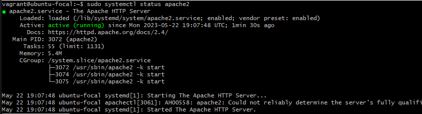
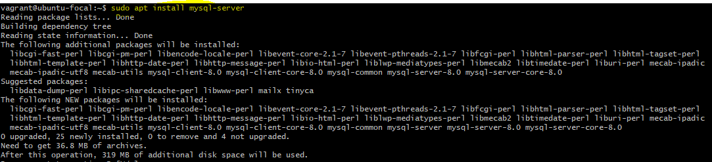
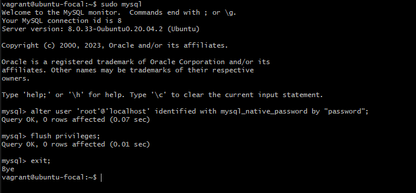
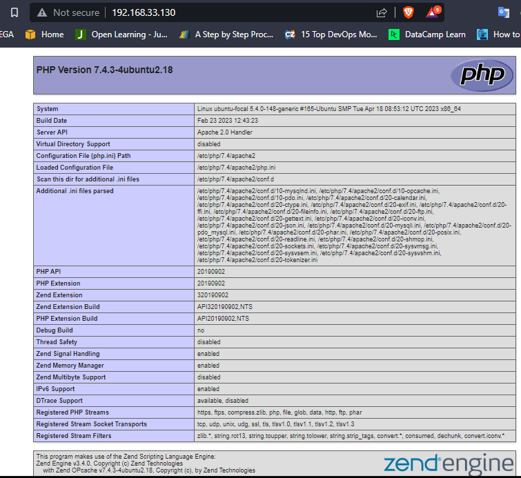

# Project 1 — LAMP STACK IMPLEMENTATION

A technology stack is a set of frameworks and tools used to develop a software product. This set of frameworks and tools are very specifically chosen to work together in creating a well-functioning software. They are acronymns for individual technologies used together for a specific technology product. some examples are…

1. LAMP (Linux, Apache, MySQL, PHP or Python, or Perl)
2. LEMP (Linux, Nginx, MySQL, PHP or Python, or Perl)
3. MERN (MongoDB, ExpressJS, ReactJS, NodeJS)
4. MEAN (MongoDB, ExpressJS, AngularJS, NodeJS)

# Configure the LAMP Stack

LAMP stands for Linux Apache MySQL and PHP. It’s a very common architecture for web applications. If you think about the LAMP stack in broad terms you have an operating system (Linux), a web server (Apache), a database tier (MySQL), and a programming language (PHP). 

# Project Recommendations
It is recommended you have familiarity with the basics of Linux, an understanding of how to configure and download various types of services and formidable researching skills.

# STEP 1 — Install Apache

Follow below steps to install and run apache linux, I am using an Ubuntu machine on VM.

```
sudo apt update 
sudo apt install apache2 
sudo systemctl enable apache2
```

Confirm apache2 is running 

```
sudo systemctl status apache2
```


Server is running and we can access it locally from an internet browser with the following url. 

To retrive the IP Address of your linux machine run 

```
ip addr show
```


```
http://localhost:80
```
Congratulations! Our web server is correctly installed


# STEP 2 — Install MYSQL

MySQL is an open-source relational database management system. A database management system (DBMS) is a software program that helps organisations optimise, store, retrieve and manage data in a database.

Follow below steps to install MySQL server
```
sudo apt install mysql-server
```

When the installation is finished, log in to the MySQL console by typing:

```
sudo mysql
```


It’s recommended to change the password of your mysql root user for security reason. This script will remove some insecure default settings and lock down access to your database system.We’re defining this user’s password as password

Run below commands to change password, flush privileges and exit.

```
alter user 'root'@'localhost' identified with mysql_native_password by "password";
flush privileges;
exit;
```


When you’re finished, test if you’re able to log in to the MySQL console by typing:

```
sudo mysql -p
```

Notice the -p flag in this command, which will prompt you for the password used after changing the root user password.


To exit the MySQL console, type:

```
exit;
```

# STEP 3 — Install PHP

A general-purpose open-source scripting language, PHP is especially suited to web development.It powers some of the most popular websites and web applications in the world.

In addition to the php package, you’ll need php-mysql, a PHP module that allows PHP to communicate with MySQL-based databases. You’ll also need libapache2-mod-php to enable Apache to handle PHP files.

To install these 3 packages at once, run:

```
sudo apt install php libapache2-mod-php php-mysql
```


Once the installation is finished, you can run the following command to confirm your PHP version:

```
php -v
```


Congratulations! your LAMP stack is completely installed and fully operational. To test the new LAMP installation, create a basic PHP script and place it in the web root directory located at /var/www/html/, then check if the script is accessible via an internet browser.

# STEP 4 — Create a Virtual Host For Your Website Using Apache
When using the Apache web server, you can create virtual hosts (similar to server blocks in Nginx) to encapsulate configuration details and host more than one domain from a single server.In this guide, you will set up a domain called cruiselamp, but you can replace this with any domain of your choice.

Follow below steps to create the directory for cruiselamp

```
sudo mkdir /var/www/cruiselamp
```
Next, assign ownership of the directory with your current system user:
```
sudo chown -R $USER:$USER /var/www/cruiselamp
```

Then, create and open a new configuration file in Apache’s sites-available directory using your preferred command-line editor. Here, we’ll be using vi or vim (They are the same by the way):

```
sudo vi /etc/apache2/sites-available/cruiselamp.conf
```

This will create a new blank file. Paste in the following bare-bones configuration by hitting on i on the keyboard to enter the insert mode, and paste the text:
```
<VirtualHost *:80>
    ServerName cruiselamp
    ServerAlias www.cruiselamp
    ServerAdmin webmaster@localhost
    DocumentRoot /var/www/cruiselamp
    ErrorLog ${APACHE_LOG_DIR}/error.log
    CustomLog ${APACHE_LOG_DIR}/access.log combined
</VirtualHost>
```


You can use the ls command to show the new file in the sites-available directory
```
sudo ls /etc/apache2/sites-available
```


You can now use a2ensite command to enable the new virtual host:
```
sudo a2ensite cruiselamp
```
You might want to disable the default website that comes installed with Apache. This is required if you’re not using a custom domain name, because in this case Apache’s default configuration would overwrite your virtual host. To disable Apache’s default website use a2dissite command , type:
```
sudo a2dissite 000-default
```
To make sure your configuration file doesn’t contain syntax errors, run:
```
sudo apache2ctl configtest
```


Finally, reload Apache so these changes take effect:
```
sudo systemctl reload apache2
```
Your new website is now active, but the web root /var/www/projectlamp is still empty. Create an index.html file in that location so that we can test that the virtual host works as expected:

```
sudo vim /var/www/cruiselamp/index.html
```
Paste the text and save:
```
<Html> 
<Head>
<title>My Website</title>
</Head>
<Body>
<p>Hello From Adegkun.</p>
</Body>
</Html>
```
Lets try to access our index.html page from an internet browser with the following url.

```
http://<your-ip>:80
```


# STEP 5 — Enable PHP On The Website

With the default DirectoryIndex settings on Apache, a file named index.html will always take precedence over an index.php file. To change this behavior, you’ll need to edit the /etc/apache2/mods-enabled/dir.conf file and change the order in which the index.php file is listed within the DirectoryIndex directive:

```
sudo vim /etc/apache2/mods-enabled/dir.conf
```
```
<IfModule mod_dir.c>
        #Change this:
        #DirectoryIndex index.html index.cgi index.pl index.php index.xhtml index.htm
        #To this:
        DirectoryIndex index.php index.html index.cgi index.pl index.xhtml index.htm
</IfModule>
```


After saving and closing the file, you will need to reload Apache so the changes take effect:
```
sudo systemctl reload apache2
```
Finally, we will create a PHP script to test that PHP is correctly installed and configured on your server.

Now that you have a custom location to host your website’s files and folders, we’ll create a PHP test script to confirm that Apache is able to handle and process requests for PHP files.

Create a new file named index.php inside your custom web root folder:
```
vim /var/www/cruiselamp/index.php
```
This will open a blank file. Add the following text, which is valid PHP code, inside the file:
```
<?php
phpinfo();
```

When you are finished, save and close the file, refresh the page and you will see a page similar to this:



This page provides information about your server from the perspective of PHP. It is useful for debugging and to ensure that your settings are being applied correctly.

If you can see this page in your browser, then your PHP installation is working as expected.

After checking the relevant information about your PHP server through that page, it’s best to remove the file you created as it contains sensitive information about your PHP environment -and your Ubuntu server. You can use rm to do so:

```
sudo rm /var/www/projectlamp/index.php
```
You can always recreate this page if you need to access the information again later.

Congratulations! your LAMP Stack Implementation. Cheers!!!