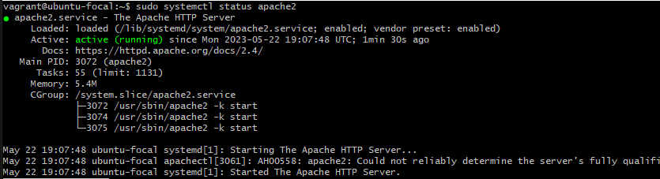
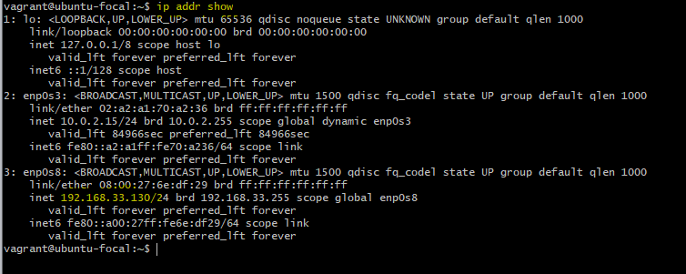
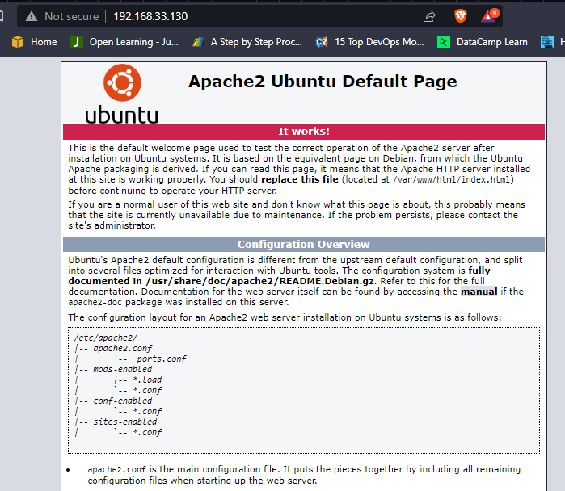
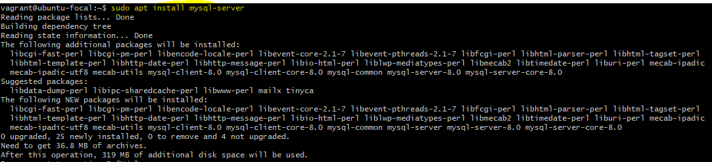
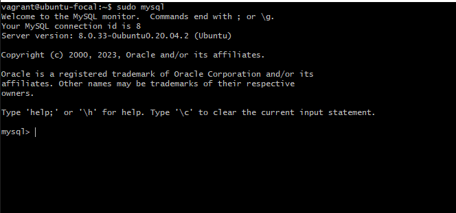
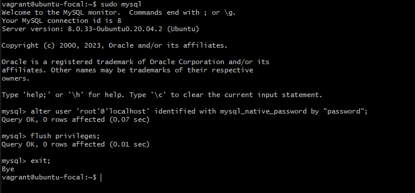
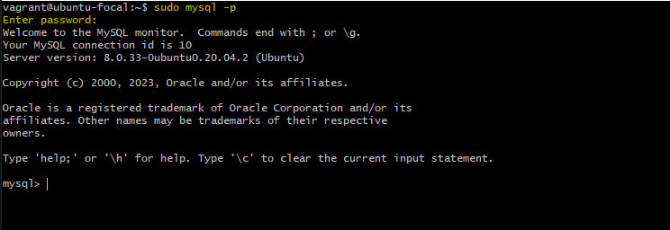

# Project 1 — LAMP STACK IMPLEMENTATION

A technology stack is a set of frameworks and tools used to develop a software product. This set of frameworks and tools are very specifically chosen to work together in creating a well-functioning software. They are acronymns for individual technologies used together for a specific technology product. some examples are…

1. LAMP (Linux, Apache, MySQL, PHP or Python, or Perl)
2. LEMP (Linux, Nginx, MySQL, PHP or Python, or Perl)
3. MERN (MongoDB, ExpressJS, ReactJS, NodeJS)
4. MEAN (MongoDB, ExpressJS, AngularJS, NodeJS)

# Configure the LAMP Stack

LAMP stands for Linux Apache MySQL and PHP. It’s a very common architecture for web applications. If you think about the LAMP stack in broad terms you have an operating system (Linux), a web server (Apache), a database tier (MySQL), and a programming language (PHP). 

# Project Recommendations
It is recommended you have familiarity with the basics of Linux, an understanding of how to configure and download various types of services and formidable researching skills.

# STEP 1 — Install Apache

Follow below steps to install and run apache linux, I am using an Ubuntu machine on VM.

```
sudo apt update 
sudo apt install apache2 
sudo systemctl enable apache2
```

Confirm apache2 is running 

```
sudo systemctl status apache2
```


Server is running and we can access it locally from an internet browser with the following url. 

To retrive the IP Address of your linux machine run 

```
ip addr show
```


```
http://localhost:80
```
Congratulations! Our web server is correctly installed


# STEP 2 — Install MYSQL

MySQL is an open-source relational database management system. A database management system (DBMS) is a software program that helps organisations optimise, store, retrieve and manage data in a database.

Follow below steps to install MySQL server
```
sudo apt install mysql-server
```

When the installation is finished, log in to the MySQL console by typing:

```
sudo mysql
```


It’s recommended to change the password of your mysql root user for security reason. This script will remove some insecure default settings and lock down access to your database system.We’re defining this user’s password as password

Run below commands to change password, flush privileges and exit.

```
alter user 'root'@'localhost' identified with mysql_native_password by "password";
flush privileges;
exit;
```


When you’re finished, test if you’re able to log in to the MySQL console by typing:

```
sudo mysql -p
```

Notice the -p flag in this command, which will prompt you for the password used after changing the root user password.



To exit the MySQL console, type:

```
exit;
```

# STEP 2 — Install MYSQL